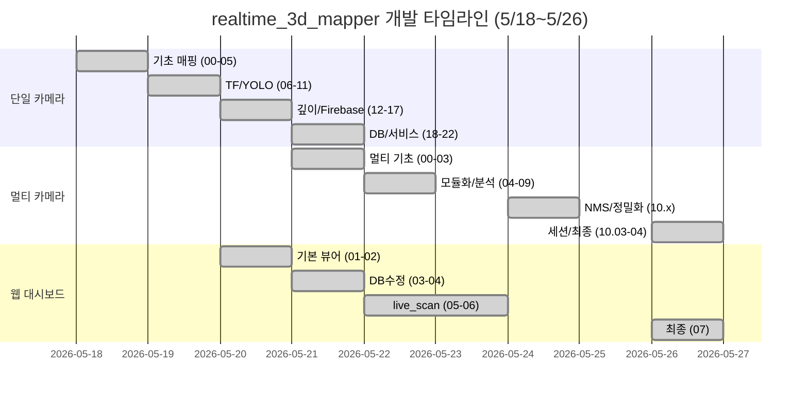

# 📋 realtime_3d_mapper & viewer 전체 버전 변경 이력

> **기간**: 2026년 5월 18일 ~ 5월 26일 (5/23, 5/25 제외)  
> **대상**: `realtime/realtime_3d_mapper_*.py`, `realtime/realtime_3d_mapper_multi_*.py`, `html/viewer_*.html`

---

## 🔧 1. realtime_3d_mapper (단일 카메라) — 00 ~ 22

| 날짜 | 파일명 | 주요 변경 내용 | 분류 |
|------|--------|---------------|------|
| 5월 18일 | `realtime_3d_mapper_00.py` | 최초 버전. Open3D + JointState 기반 실시간 3D 매핑. 수동 FK 수식으로 카메라 위치 계산. 키보드 'S' PCD 저장 | 3D 매핑 기초 |
| 5월 18일 | `realtime_3d_mapper_01.py` | **Plotly HTML 뷰어 저장 추가**. PCD + HTML 동시 저장. 웹용 1cm 다운샘플링. 어두운 배경 테마 | 시각화 개선 |
| 5월 18일 | `realtime_3d_mapper_02.py` | **ICP 정합 알고리즘 추가**. 기구학 초기값 + ICP 미세 보정. 탐색 반경 3cm, 최대 30회 반복 | 정밀도 개선 |
| 5월 18일 | `realtime_3d_mapper_03.py` | **Open3D 완전 제거**, 순수 NumPy. Foxglove/RViz용 `/accumulated_map` 퍼블리시 추가 | 경량화 |
| 5월 18일 | `realtime_3d_mapper_04.py` | **단일 프레임 스냅샷 방식 도입**. 거리 필터(0.2~1.2m). Voxel 3mm 초정밀 | 스냅샷 모드 |
| 5월 18일 | `realtime_3d_mapper_05.py` | **터미널 's' 키로 다중 누적 스냅샷**. 정지→캡처→누적→통합 저장. `tty.setcbreak` 비동기 키입력 | 누적 매핑 |
| 5월 19일 | `realtime_3d_mapper_06.py` | **수동 FK → ROS 2 TF2 전환**. `tf2_ros.Buffer` + `TransformListener`. JointState 구독 제거 | 좌표계 개선 |
| 5월 19일 | `realtime_3d_mapper_07.py` | **두산 서비스 API(GetCurrentPosx) 도입**. 비동기 X/Y/Z/A/B/C 취득. 카메라 광학 회전 보정 | 서비스 기반 |
| 5월 19일 | `realtime_3d_mapper_08.py` | **StaticTransformBroadcaster 도입**. link_6→camera_link 정적 TF 자동 퍼블리시. Threading 키보드 | TF 자동화 |
| 5월 19일 | `realtime_3d_mapper_09.py` | **카메라 장착 회전각 보정** (Quaternion -0.5,-0.5,-0.5,0.5). Voxel 2mm HTML 해상도 향상 | 축 보정 |
| 5월 19일 | `realtime_3d_mapper_10.py` | **YOLO 물체 감지 통합 (최초)**. 2D Image 구독. YOLO→바운딩 박스→3D 스케일링→base_link 변환 | AI 통합 시작 |
| 5월 19일 | `realtime_3d_mapper_11.py` | **스마트 주변 탐색 알고리즘** (11×11). NaN 도넛 현상 해결. 가장 가까운 표면점 자동 선택 | YOLO 정밀도 |
| 5월 20일 | `realtime_3d_mapper_12.py` | **Aligned Depth + Pinhole 기반 정밀 좌표**. `aligned_depth_to_color` 구독. fx/fy/cx/cy 활용. 시차 보정 | 깊이 정밀화 |
| 5월 20일 | `realtime_3d_mapper_13.py` | **YOLO 모델을 good/ng 판정으로 교체**. 녹색/빨간색 분류. 단차 검출 개념 등장 | 검사 판정 |
| 5월 20일 | `realtime_3d_mapper_14.py` | 나사 체결 단차 정밀 측정. 3D 표면 vs 나사 머리 높이차(mm) 산출 | 단차 측정 |
| 5월 20일 | `realtime_3d_mapper_15.py` | 단차 기반 자동 판정 (임계값 good/ng). 깊이 차이 수치로 판정 전환 | 자동 판정 |
| 5월 20일 | `realtime_3d_mapper_16.py` | 판정 결과 정리 및 콘솔 출력 포맷 개선. 코드 경량화 | 리팩토링 |
| 5월 20일 | `realtime_3d_mapper_17.py` | **Firebase Storage 업로드 추가**. HTML 결과 자동 업로드. Firebase Admin SDK 초기화 | 클라우드 연동 |
| 5월 21일 | `realtime_3d_mapper_18.py` | Firebase 업로드 헬퍼 함수 분리. 에러 핸들링 강화 | Firebase 개선 |
| 5월 21일 | `realtime_3d_mapper_19__.py` | Firebase 설정 변수 정리. 코드 안정화 | 안정화 |
| 5월 21일 | `realtime_3d_mapper_20__.py` | **Firebase Realtime DB 연동**. Storage + DB 동시 사용. 검사 카운트 DB 자동 관리. JS 배경 업로드 | DB 통합 |
| 5월 21일 | `realtime_3d_mapper_21__.py` | Firebase 키 경로를 로컬 개발환경으로 변경 | 환경 설정 |
| 5월 21일 | `realtime_3d_mapper_22.py` | **ROS 2 서비스(SrvDepthPosition) 아키텍처 전환**. 키보드 제거 → 서비스 호출로 검사 시작 | 서비스 아키텍처 |

---

## 🔧 2. realtime_3d_mapper_multi (멀티 카메라) — 00 ~ 10_04

| 날짜 | 파일명 | 주요 변경 내용 | 분류 |
|------|--------|---------------|------|
| 5월 21일 | `multi_00.py` | **멀티 카메라 지원 최초 버전**. 단일→멀티 아키텍처 전환 | 멀티 기초 |
| 5월 21일 | `multi_01.py` | 멀티 카메라 간 좌표계 통합 로직 보강 | 좌표 통합 |
| 5월 21일 | `multi_02.py` | 멀티 카메라 데이터 동기화 개선. 안정성 향상 | 동기화 |
| 5월 21일 | `multi_03.py` | 멀티 환경에서 YOLO 감지 통합 및 좌표 병합 | YOLO 멀티 |
| 5월 22일 | `multi_04_00.py` | 나사 단차 + RANSAC 평면 피팅 알고리즘 도입 | 단차 분석 |
| 5월 22일 | `multi_04_01.py` | **공통 모듈(common/) 도입**. `settings`, `db_paths`, `firebase_client` 분리 | 모듈화 |
| 5월 22일 | `multi_05.py` | **Trigger 서비스 기반 전환**. `/vision_inspect` 서비스. VisionServerNode 클래스 | 서비스 전환 |
| 5월 22일 | `multi_06.py` | common 모듈 + Trigger 서비스 통합. `get_db_reference` 유틸리티 | 통합 안정화 |
| 5월 22일 | `multi_07.py` | **나사 분석 대폭 강화**. `analyze_screw_with_retry`, `calculate_target_pose`, `fit_plane_ransac` | 분석 고도화 |
| 5월 22일 | `multi_08.py` | **Firebase DB 구조 대폭 확장**. 5개 모듈화 DB 함수. `live_scan/workstations` 실시간 통신 | DB 구조화 |
| 5월 22일 | `multi_09.py` | `live_screws_data` 키 포맷 통일 (`screw_00`). 레거시/신규 DB 동시 기록 안정화 | DB 안정화 |
| 5월 24일 | `multi_10_00.py` | 코드 정리 및 안정화. multi_09 기반 리팩토링 | 정리 |
| 5월 24일 | `multi_10_01.py` | **중복 바운딩 박스 문제 인식**. 다중 클래스 겹침 현상 발견 | 버그 인식 |
| 5월 24일 | `multi_10_02.py` | **NMS/IoU 기반 중복 바운딩 박스 필터링 추가**. 신뢰도 높은 박스만 유지 | 중복 제거 |
| 5월 24일 | `multi_10_03_00.py` | **나사 중심점 정밀화**. `get_robust_screw_center` — 컬러 마스킹, Connected Components, HSV | 중심점 정밀화 |
| 5월 24일 | `multi_10_03_01.py` | 중심점 안정화. `screw_id` 1-based 변경 (`screw_1`, `screw_2`) | 번호 체계 |
| 5월 26일 | `multi_10_03_02.py` | `live_scan` 초기화 개선 — 세션 시작 시 이전 데이터 자동 삭제 | DB 초기화 |
| 5월 26일 | `multi_10_03_03.py` | **멀티 카메라 콜백 리팩토링** + **세션 리셋 서비스** (`/start_new_session`) | 멀티 카메라 |
| 5월 26일 | `multi_10_03_04__.py` | multi_10_03_03과 동일. 백업/안정화 버전 | 백업 |
| 5월 26일 | `multi_10_04.py` | **중심점 알고리즘 변경** → `get_highest_point_in_bbox`. 단순화된 중심점 로직 | 중심점 단순화 |

---

## 🌐 3. viewer HTML (Firebase 대시보드) — 01 ~ 07

| 날짜 | 파일명 | 주요 변경 내용 | 분류 |
|------|--------|---------------|------|
| 5월 20일 | `viewer_01.html` | **최초 웹 대시보드**. Plotly + Firebase. `linestatus` 구독. 나사 3D Scatter3d 렌더링 | 대시보드 기초 |
| 5월 20일 | `viewer_02.html` | **3D 회전 기능 추가**. 카메라 앵글 설정. 나사 상태 클릭 시 DB 업데이트 | 3D 인터랙션 |
| 5월 21일 | `viewer_03.html` | Firebase DB 주소 asia-southeast1 리전 교체. 3D 초기 앵글 설정 | DB 연결 수정 |
| 5월 21일 | `viewer_04.html` | 나사 상태 토글 — 클릭 시 `linestatus` DB 직접 업데이트. UI 조정 | 상태 토글 |
| 5월 22일 | `viewer_05.html` | **DB 경로 `linestatus` → `live_scan/workstations` 전환**. Firebase 전체 config | live_scan 전환 |
| 5월 24일 | `viewer_06.html` | **대폭 UI 개편** (371줄). 좌측 3D + 우측 패널. JS 배경 동적 로드. 반응형 디자인 | 통합 대시보드 |
| 5월 26일 | `viewer_07.html` | viewer_06 기반 안정화. 렌더링 버그 수정. 최종 배포 버전 | 안정화 |

---

## 📊 타임라인

---

## 🔑 핵심 전환점

| # | 전환점 | 관련 버전 | 날짜 |
|---|--------|----------|------|
| 1 | Open3D → 순수 NumPy 전환 | `mapper_03` → `mapper_04` | 5월 18일 |
| 2 | 수동 FK → ROS 2 TF2 전환 | `mapper_06` | 5월 19일 |
| 3 | YOLO 물체 감지 최초 도입 | `mapper_10` | 5월 19일 |
| 4 | Pinhole 카메라 모델 도입 | `mapper_12` | 5월 20일 |
| 5 | Firebase 클라우드 연동 | `mapper_17` | 5월 20일 |
| 6 | 서비스 아키텍처 전환 | `mapper_22` / `multi_05` | 5월 21~22일 |
| 7 | 공통 모듈(common/) 분리 | `multi_04_01` | 5월 22일 |
| 8 | 멀티 모듈 DB 구조화 | `multi_08` | 5월 22일 |
| 9 | NMS 중복 제거 도입 | `multi_10_02` | 5월 24일 |
| 10 | 나사 중심점 정밀화 | `multi_10_03_00` | 5월 24일 |
